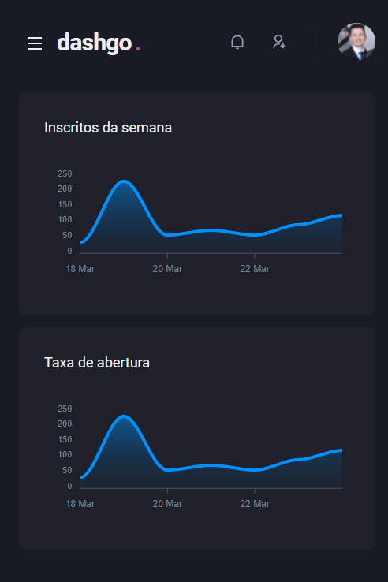
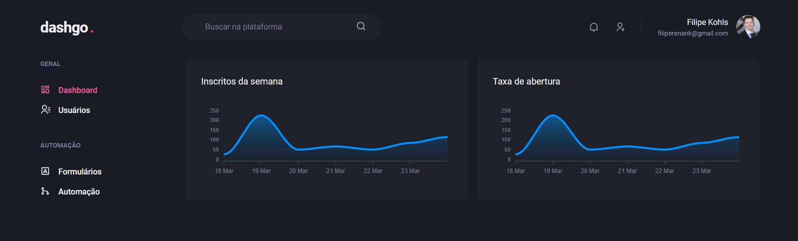

<h1> Dashgo</h1>

<p align="center"  > 
   
  
</p>

## 📚 Informações sobre o projeto
Criando interface declarativa com ChakraUI.
* Esse projeto foi desenvolvido durante o capítulo 4 de ReactJS do Ignite da Rocketseat. <br/>
* A ideia foi desenvolver completamente um dashboard usando Chakra UI, deixando também a aplicação responsiva.
  - Interface de login, painel administrativo, dashboard, listagem e criação de usuário com componentes do ChakraUI.
  - Data Fetching com ReactQuery 
  - Verificação de erros nos campos de formulário usando Yup + React Hook Form

<h2>🛠️ Tecnologias utilizadas: </h2> 

- <a href="https://nextjs.org" > Next.js </a>
- <a href="https://www.typescriptlang.org/"> TypeScript </a>
- <a href="https://chakra-ui.com"> Chakra UI </a>
- <a href="https://apexcharts.com"> Apexcharts.js </a>
- <a href="https://react-hook-form.com"> React Hook Form </a>
- <a href="https://github.com/jquense/yup"> Yup </a>
- <a href="https://react-query.tanstack.com"> React Query </a>
- <a href="https://miragejs.com"> Mirage JS </a>
- <a href="https://github.com/marak/Faker.js/"> Faker </a>

## ⚙️ Instalação
```
# Abra um terminal e copie este repositório com o comando
$ git clone https://github.com/FilipeRK/Ignite-ChapterIV-dashgo.git
```

```
# Acesse a pasta da aplicação
$ cd Ignite-ChapterIV-dashgo

# Instale as dependências
$ yarn

# Inicie a aplicação
$ yarn dev

```

<br/>
<p >Desenvolvido por <a href="https://github.com/FilipeRK">Filipe Kohls</a>
